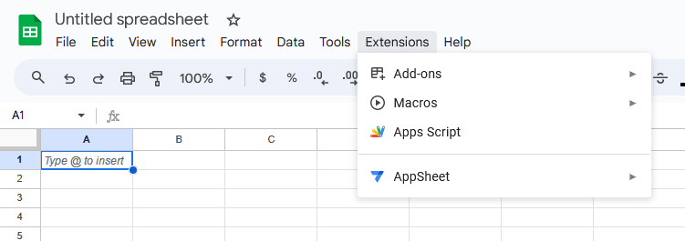

# Google Sheets & Google Calendar Synchronizer

[Google Sheets](https://www.google.com/sheets/about/) & [Google Calendar](https://workspace.google.com/products/calendar/) Synchronizer helps us to enhance our productivity connecting these two amazing Google tools.

## Requirements

- Google Account
- Basic Javascript knowledge

## Usage

- Log in to your Google Account;
- Create a Spreadsheet;
- Go to the tab Extensions and the to the Apps Script menu;

- In the Google App Scripts editor copy and paste the code in the [main.js](https://github.com/sarahcssiqueira/google-sheets-calendar-synchronizer/blob/master/main.js) file of this repository;
- Make sure to **replace 'YOUR CALENDAR ID'** with the id of the Google Calendar you want to synchronize.

### Sample Spreadsheet

That's a sample of a [spreadsheet already correctly formatted](https://docs.google.com/spreadsheets/d/1SO8Ealz15EUsJdb51sZYLiMsokyFSk0OQNZXXusKyvU/edit?usp=sharing) to work with the following script.

## Commom errors

[TO DO]

## References

- [G Suite Pro Tips](https://workspace.google.com/blog/productivity-collaboration/g-suite-pro-tip-how-to-automatically-add-a-schedule-from-google-sheets-into-calendar)
- [Class Calendar](<https://developers.google.com/apps-script/reference/calendar/calendar?hl=pt-br#createAllDayEvent(String,Date,Object)>)
- [Google Sheets - Use Apps Script to Create Google Calendar Events Automatically](https://www.youtube.com/watch?v=FxxPq2wXcK4)
- [Custom Colors](https://developers.google.com/apps-script/reference/calendar/event-color?hl=pt-br)
- [Custom Menus](https://developers.google.com/apps-script/guides/menus?hl=pt-br)

## License

This project is licensed under the [MIT](https://github.com/sarahcssiqueira/google-sheets-calendar-synchronizer/blob/master/LICENSE) license.
